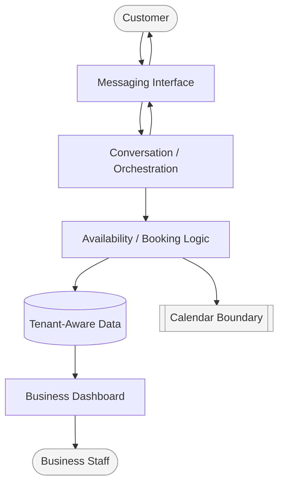

# TorBot

**TorBot is a production-oriented, multi-tenant appointment booking platform that turns WhatsApp into a complete scheduling channel.** This repository is a public engineering showcase: it documents what was built and how it was designed, without exposing the production system itself.

TorBot lets small and mid-sized service businesses — salons, clinics, studios — manage bookings, customers, and availability through a conversational WhatsApp flow, backed by a business-facing dashboard and a calendar-aware automation engine.

It is not the production codebase, and it intentionally does not expose workflow implementations, internal contracts, or operational internals. See [`DISCLAIMER.md`](./DISCLAIMER.md) for what is and isn't included here.

---

## Highlights

- WhatsApp-native booking, rescheduling, and cancellation
- Multi-tenant architecture that keeps each business's customers and calendars scoped to that business
- Real-time availability checks designed to prevent double-booking
- Business dashboard for bookings, staff, and activity
- Waitlist handling for fully booked slots
- Calendar-synchronized appointment state

## The Problem

Service businesses lose bookings to friction: phone tag, missed messages, double-booked slots, and no-shows that go untracked. Most booking tools assume the customer will open an app or a web form. In practice, the channel customers already use — WhatsApp — is rarely treated as a first-class interface for scheduling.

TorBot was built to close that gap: let the customer book, reschedule, or cancel entirely inside a WhatsApp conversation, while giving the business owner a single dashboard to see and control what's happening across every customer and every tenant.

For the motivation behind the product, see [Why TorBot Exists](./docs/why-torbot-exists.md).

## What TorBot Does

- **WhatsApp-native booking** — customers schedule, modify, and cancel appointments through natural conversation, no app install required.
- **Multi-tenant by design** — a single platform instance serves multiple independent businesses, with each business's customers, staff, and calendars scoped to that business.
- **Real-time availability** — bookings are checked and held against live calendar state, designed to prevent double-booking.
- **Business dashboard** — owners and staff view bookings, manage availability, and track activity without touching the underlying automation.
- **Waitlist handling** — when a slot isn't available, customers can be queued and notified if one opens up.
- **Calendar integration** — appointment state stays synchronized with the business's calendar.

These are described here at a conceptual level. Implementation specifics — workflow logic, internal data contracts, and orchestration details — are intentionally out of scope for this repository.

## Architecture, at a Glance

TorBot is built as an automation-first system: a conversational front end (WhatsApp) talks to an orchestration layer that manages booking state, availability, and tenant scoping, with a lightweight dashboard giving businesses visibility into their own data.



A full architecture walkthrough — including the high-level component map and how multi-tenancy is handled — lives in [`docs/architecture-overview.md`](./docs/architecture-overview.md).

## Booking Flow

At a high level, a booking moves through: conversation start → intent recognition → availability check → slot hold → confirmation → calendar sync. Edge cases like conflicting requests, cancellations, and waitlisting are handled as variations of this same flow.

A stage-by-stage walkthrough is documented in [`docs/appointment-lifecycle.md`](./docs/appointment-lifecycle.md).

## Technology

TorBot is built on a workflow-automation backend integrated with messaging and calendar services, with a lightweight dashboard for business visibility. Specific technology choices are documented separately in [`docs/technology-stack.md`](./docs/technology-stack.md).

## Why This Repository Exists

This showcase exists to demonstrate engineering judgment, not to hand over a working clone. Every asset here — diagrams and written documentation — has been deliberately reviewed and sanitized so the engineering story is clear while the production system stays protected.

If you're a recruiter, engineering manager, or technical peer evaluating this work, the goal is that within a few minutes you understand what was built, how it's structured, and why the decisions behind it hold up — without learning anything that could be used to reconstruct the production system.

The reasoning behind that boundary is detailed in [Repository Philosophy](./docs/repository-philosophy.md).

## Explore Further

**Documentation**

| Doc | What it covers |
|---|---|
| [Product Overview](./docs/product-overview.md) | What TorBot does and who it's for |
| [Why TorBot Exists](./docs/why-torbot-exists.md) | The problem and why WhatsApp-first |
| [Architecture Overview](./docs/architecture-overview.md) | System components and how they fit together |
| [Architecture Evolution](./docs/architecture-evolution.md) | How the design grew under pressure |
| [Appointment Lifecycle](./docs/appointment-lifecycle.md) | The booking lifecycle, stage by stage |
| [Technology Stack](./docs/technology-stack.md) | What TorBot is built with |
| [Engineering Decisions](./docs/engineering-decisions.md) | Key trade-offs and the reasoning |
| [Lessons Learned](./docs/lessons-learned.md) | What the build taught, and decisions I'd revisit |
| [My Role](./docs/my-role.md) | What I designed, built, and operated |
| [Repository Philosophy](./docs/repository-philosophy.md) | Why the public/private boundary sits where it does |
| [Security & Sanitization](./docs/security-and-sanitization.md) | How public content is sanitized before publishing |

**Engineering case studies**

In-depth looks at specific problems and the engineering reasoning behind them:

- [Booking Consistency Under Concurrent Demand](./docs/case-studies/booking-consistency.md)
- [Managing State in an Asynchronous Conversation](./docs/case-studies/conversation-state.md)
- [Knowing an Unattended System Is Working](./docs/case-studies/operational-monitoring.md)

## Repository Structure

```text
TorBot-Engineering-Showcase/
├── README.md                         Overview and entry point
├── DISCLAIMER.md                     What is and isn't included
├── docs/
│   ├── product-overview.md           What TorBot does and who it's for
│   ├── why-torbot-exists.md          Motivation and product reasoning
│   ├── architecture-overview.md      System components and structure
│   ├── architecture-evolution.md     How the design grew under pressure
│   ├── appointment-lifecycle.md      The booking lifecycle, stage by stage
│   ├── technology-stack.md           What TorBot is built with
│   ├── engineering-decisions.md      Key trade-offs and reasoning
│   ├── lessons-learned.md            What the build taught
│   ├── my-role.md                    Scope of ownership
│   ├── repository-philosophy.md      The public/private boundary
│   ├── security-and-sanitization.md  How content is sanitized
│   └── case-studies/                 Deep dives into specific problems
│       ├── booking-consistency.md
│       ├── conversation-state.md
│       └── operational-monitoring.md
└── diagrams/                         Mermaid sources for the embedded diagrams
    ├── system-overview.mmd
    ├── component-map.mmd
    └── appointment-lifecycle.mmd
```

**Suggested reading order**

1. **This README** — the overview and entry point.
2. **[Why TorBot Exists](./docs/why-torbot-exists.md)** and **[Product Overview](./docs/product-overview.md)** — the motivation and the product.
3. **[Architecture Overview](./docs/architecture-overview.md)** and **[Architecture Evolution](./docs/architecture-evolution.md)** — how it's built and how it got there.
4. **[Appointment Lifecycle](./docs/appointment-lifecycle.md)** and **[Technology Stack](./docs/technology-stack.md)** — the core booking journey and the tools behind it.
5. **[Engineering Decisions](./docs/engineering-decisions.md)** and the **[case studies](./docs/case-studies/)** — the trade-offs, then the deep dives that show them in action.
6. **[Lessons Learned](./docs/lessons-learned.md)**, **[My Role](./docs/my-role.md)**, **[Repository Philosophy](./docs/repository-philosophy.md)**, and **[Security & Sanitization](./docs/security-and-sanitization.md)** — reflection, ownership, and the boundary.

## What's Intentionally Not Here

In line with this project's sanitization rules, this repository does not include: workflow exports, internal automation logic, API payloads, credentials or secrets, internal record identifiers, production URLs, or customer data. See [`DISCLAIMER.md`](./DISCLAIMER.md) for the full boundary, and [Security & Sanitization](./docs/security-and-sanitization.md) for how content is reviewed before it's published here.

---

## Repository Status

**Type:** Public engineering showcase

**Maturity:** Actively maintained

**Scope:** Conceptual documentation only — no production code, workflows, or operational assets

