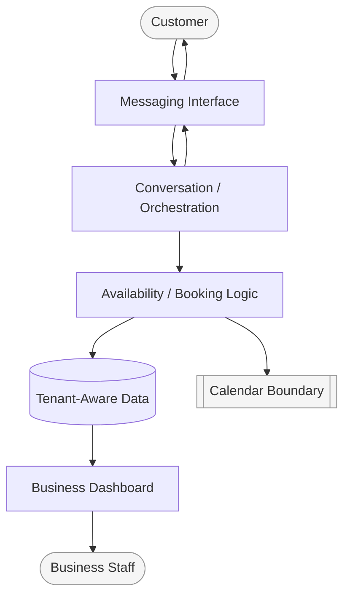
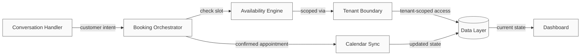

# TorBot — Architecture Overview

## 1. Architecture Philosophy

TorBot's architecture follows one core idea: the conversation is the interface, and everything else exists to make that conversation reliable. The system is built so that a customer's WhatsApp message can be understood, checked against real availability, and turned into a confirmed booking — consistently, for many independent businesses at once, with each business's requests processed within its own tenant-scoped context.

Three priorities shaped the architecture: conversational reliability, tenant scoping, and operational visibility for the business owner.

## 2. System Overview

At a high level, TorBot is composed of four cooperating layers:

1. A **conversational interface layer** that receives and sends WhatsApp messages.
2. An **orchestration layer** that interprets intent, coordinates availability checks, and drives the booking lifecycle.
3. A **data layer** that holds tenant-scoped records — businesses, customers, staff, slots, and appointments.
4. A **visibility layer** — the business dashboard — that surfaces what's happening to the people running the business.

These layers are deliberately separated so that the conversational experience, the booking logic, and the data each business owns can evolve independently.

## 3. Major Components

- **Conversation Handler** — receives inbound WhatsApp messages, maintains conversational context, and routes intent (book, reschedule, cancel, check status) onward.
- **Availability Engine** — the source of truth for whether a requested slot can be booked, checked in real time before any confirmation is given.
- **Booking Orchestrator** — coordinates the steps between an incoming request and a confirmed appointment: validating intent, holding a slot, confirming, and syncing the result.
- **Tenant Boundary** — the layer responsible for ensuring every request, record, and response stays scoped to the correct business.
- **Calendar Sync** — keeps appointment state consistent between TorBot's records and the business's calendar.
- **Dashboard** — a read-and-manage surface for business owners and staff, reflecting the current state of bookings and availability without exposing the underlying orchestration.

Each component has a single responsibility. None of them depend on knowing the internal logic of another beyond the data they need to exchange.

## 4. Information Flow

A request enters through the Conversation Handler, which determines intent and hands it to the Booking Orchestrator. The Orchestrator consults the Availability Engine — scoped to the correct tenant via the Tenant Boundary — before committing to a slot. Once a booking is confirmed, Calendar Sync propagates the change, and the Dashboard reflects the updated state for the business.

The flow is intentionally linear and auditable: a request always passes through the same sequence of checks before it becomes a confirmed appointment, which is designed to make double-booking structurally difficult rather than merely discouraged.

## 5. Multi-Tenant Design

TorBot serves many independent businesses from shared infrastructure, tenant-scoped at the data and request level rather than through separate deployments per business. Every request carries tenant context from the moment it enters the system, and that context is checked at each layer — conversation, availability, data, and dashboard — so that each business's customers, staff, and calendar are processed within their own business context.

This approach was chosen so the platform can scale to many businesses without the operational cost of standing up dedicated infrastructure for each one, while still giving each tenant the experience of a dedicated system.

## 6. Architectural Principles

- **Single source of truth for availability** — no booking is confirmed without a real-time check, which is designed to prevent conflicting state from emerging in the first place.
- **Tenant scoping by default** — tenant scoping is applied structurally, not left to convention.
- **Separation of conversation from logic** — the messaging interface can evolve without requiring changes to booking logic, and vice versa.
- **Visibility without exposure** — the dashboard gives business owners full insight into their own operations while abstracting away the orchestration underneath.
- **Linear, auditable booking lifecycle** — every booking follows the same sequence of steps, making the system's behavior predictable and easier to reason about.

## 7. System Boundaries

TorBot's architecture is scoped to the booking lifecycle and the visibility a business needs to operate it. It does not attempt to be a general-purpose CRM, a marketing automation platform, or a payments system. Where TorBot integrates with external services — messaging and calendar providers — those integrations are treated as boundaries the system talks across, not internals the system owns.

What this document intentionally does not cover: specific technologies, internal data contracts, deployment topology, and workflow-level implementation. Those are out of scope for an architecture-level explanation and are not published in this repository.

## 8. Why This Architecture

This structure exists because the hardest problems in a WhatsApp-native booking platform aren't the conversation itself — they're keeping availability correct under concurrent requests and keeping many businesses' data tenant-scoped while sharing infrastructure. Separating conversation, orchestration, data, and visibility into distinct components made both of those problems tractable: availability correctness lives in one place, tenant scoping is applied consistently across layers, and the dashboard can present a clean view of state without needing to understand how that state was produced.

The result is a system designed to scale across businesses without each business needing to trust a one-off configuration, and to stay reliable as the conversational surface grows in complexity.
